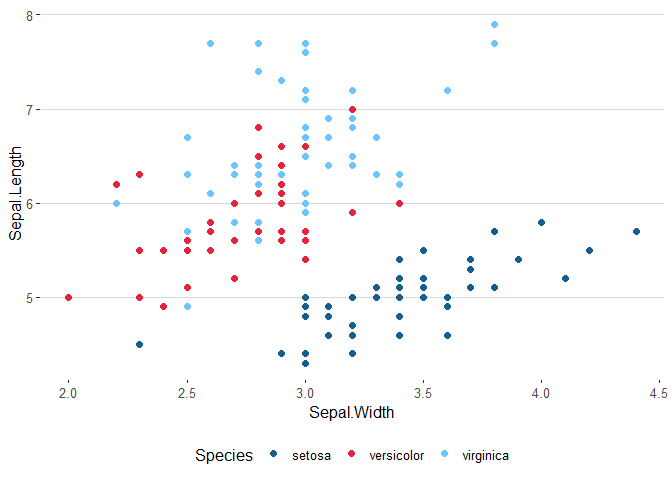
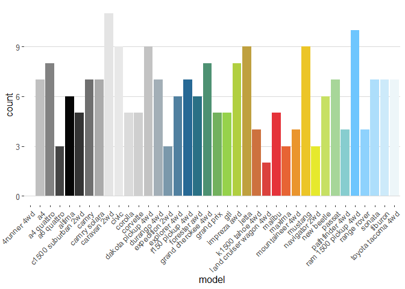

<!-- README.md is generated from README.Rmd. Please edit that file -->

# bsscol

<!-- badges: start -->
<!-- badges: end -->

bsscol allows for a simple integration of the BSS base colors into
ggplot2 and alike.

## installation

You can install the released version of bsscol from
[Github](https://github.com/qwertzlbry/bsscol) with:

``` r
library(devtools) # install devtool first if not installed
install_github("qwertzlbry/bsscol")
```

With a future CRAN approval the package could be installed with:

``` r
install.packages("bsscol") # currently the installation works only over github
```

In order to run the following examples you’ll also need:

``` r
install.packages("ggplot2")
install.packages("plotrix")
```

## load packages

``` r
library(bsscol)
library(ggplot2)
library(plotrix)
```

## the colors

``` r
# the colors
bss_colors
#>  sky blue    yellow       red     green      blue 
#> "#6bc5ff" "#eeec22" "#e5233d" "#abe441" "#155f90"
pie3D(rep(10, 5),explode=0, theta=1.2, col=bss_colors, main="bss_colors")
```


## function: bss\_cols() - examples

The bss\_cols function allows you to get hex colors in a robust and
flexible way.

``` r
# to get the information of a color
bss_cols("red")
#>       red 
#> "#e5233d"
# or to just use a color in a plot
ggplot(mtcars, aes(hp, mpg)) +
  geom_point(color = bss_cols("red"),
             size = 2, alpha = .8)
```


## function: bss\_pal() - examples

With a subset of palettes of the original colors this function allows to
interpolate the palette colors for a certain number of levels, making it
possible to create shades between the original colors. Further, it gets
a pallette by name from the list (“main” by default) and has a boolean
condition determining whether to reverse the order or not.

``` r
# the following subset color palettes are available 
bss_palettes
#> $rgb
#>       red     green      blue 
#> "#e5233d" "#abe441" "#155f90" 
#> 
#> $cool
#>      blue  sky blue     green 
#> "#155f90" "#6bc5ff" "#abe441" 
#> 
#> $hot
#>    yellow       red     green 
#> "#eeec22" "#e5233d" "#abe441" 
#> 
#> $main
#>  sky blue    yellow       red     green      blue 
#> "#6bc5ff" "#eeec22" "#e5233d" "#abe441" "#155f90"

# interpolate the "rgb" palette (which only includes three colors, red, green and blue) to a length of 9:
bss_pal("rgb")(9)
#> [1] "#E5233D" "#D6533E" "#C8833F" "#B9B340" "#ABE441" "#85C254" "#60A168"
#> [8] "#3A807C" "#155F90"
pie3D(rep(10, 9),explode=0, theta=1.2, col=bss_pal("rgb")(9), main="bss_pal()")
```


## function: scale\_color\_bss() - example

Custom color scale functions for ggplot2.

``` r
# Color by discrete variable using default palette
ggplot(iris, aes(Sepal.Width, Sepal.Length, color = Species)) +
  geom_point(size = 2) +
  scale_color_bss()
```



``` r
# Color by numeric variable with cool palette
ggplot(iris, aes(Sepal.Width, Sepal.Length, color = Sepal.Length)) +
  geom_point(size = 2, alpha = .6) +
  scale_color_bss(discrete = FALSE, palette = "cool")
```


## function: scale\_fill\_bss() - example

Custom fill scale functions for ggplot2.

``` r
# Fill by discrete variable with different palette + remove legend (guide)
ggplot(mpg, aes(manufacturer, fill = manufacturer)) +
  geom_bar() +
  theme(axis.text.x = element_text(angle = 45, hjust = 1)) +
  scale_fill_bss(palette = "main", guide = "none")
```


