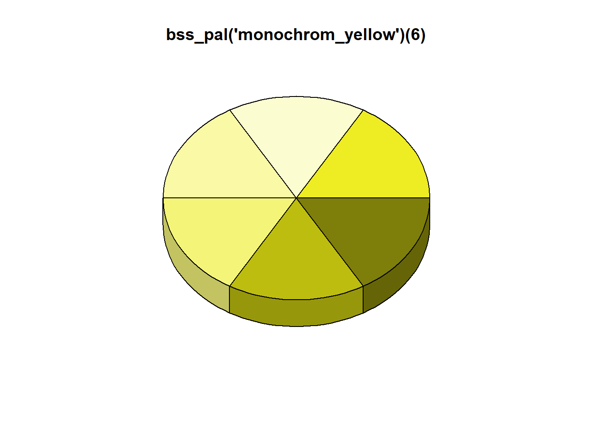
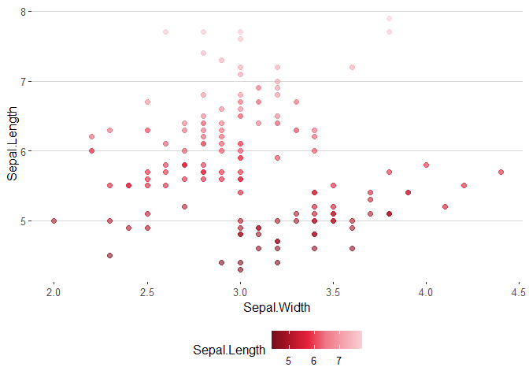

<!-- README.md is generated from README.Rmd. Please edit that file -->

# bsscol

<!-- badges: start -->

<!-- badges: end -->

bsscol allows for a simple integration of the BSS base colors into
ggplot2 and alike.

## installation

You can install the released version of bsscol from
[Github](https://github.com/qwertzlbry/bsscol) with:

``` r
library(devtools) # install devtool first if not installed
install_github("qwertzlbry/bsscol")
```

With a future CRAN approval the package could be installed with:

``` r
install.packages("bsscol") # currently the installation works only over github
```

In order to run the following examples you’ll also need:

``` r
install.packages("ggplot2")
install.packages("plotrix")
install.packages("dplyr")
install.packages("hues")
install.packages("DT")
```

## load packages

``` r
library(bsscol)
library(ggplot2)
#> Warning: package 'ggplot2' was built under R version 3.6.3
library(plotrix)
#> Warning: package 'plotrix' was built under R version 3.6.3
library(hues)
#> Warning: package 'hues' was built under R version 3.6.3
library(dplyr)
#> 
#> Attaching package: 'dplyr'
#> The following objects are masked from 'package:stats':
#> 
#>     filter, lag
#> The following objects are masked from 'package:base':
#> 
#>     intersect, setdiff, setequal, union
library(kableExtra)
#> Warning: package 'kableExtra' was built under R version 3.6.3
#> 
#> Attaching package: 'kableExtra'
#> The following object is masked from 'package:dplyr':
#> 
#>     group_rows
```

## the colors

``` r
#the colors, RGB and hex codes
bss_colors <- bss_colors %>% dplyr::arrange(col_pal) %>% dplyr::select(-colour)
bss_dt <- bss_colors
bss_dt$hashed_hex = cell_spec(
  bss_dt$hashed_hex, color = "white", align = "c", #angle = 2,
  background = factor(bss_dt$excel_form,bss_dt$excel_form, bss_dt$hashed_hex))

kbl(bss_dt, escape = F) %>%
  kable_paper("striped", full_width = F)
```

<table class=" lightable-paper lightable-striped" style="font-family: &quot;Arial Narrow&quot;, arial, helvetica, sans-serif; width: auto !important; margin-left: auto; margin-right: auto;">

<thead>

<tr>

<th style="text-align:left;">

R

</th>

<th style="text-align:left;">

G

</th>

<th style="text-align:left;">

B

</th>

<th style="text-align:left;">

hex

</th>

<th style="text-align:right;">

Typ

</th>

<th style="text-align:left;">

Full

</th>

<th style="text-align:right;">

col\_pal

</th>

<th style="text-align:left;">

hashed\_hex

</th>

<th style="text-align:right;">

excel\_form

</th>

<th style="text-align:left;">

name

</th>

</tr>

</thead>

<tbody>

<tr>

<td style="text-align:left;">

255

</td>

<td style="text-align:left;">

255

</td>

<td style="text-align:left;">

255

</td>

<td style="text-align:left;">

FFFFFF

</td>

<td style="text-align:right;">

0

</td>

<td style="text-align:left;">

255,255,255

</td>

<td style="text-align:right;">

1

</td>

<td style="text-align:left;">

<span style="     color: white !important;border-radius: 4px; padding-right: 4px; padding-left: 4px; background-color: #FFFFFF !important;text-align: c;">\#FFFFFF</span>

</td>

<td style="text-align:right;">

1

</td>

<td style="text-align:left;">

weiss

</td>

</tr>

<tr>

<td style="text-align:left;">

242

</td>

<td style="text-align:left;">

242

</td>

<td style="text-align:left;">

242

</td>

<td style="text-align:left;">

F2F2F2

</td>

<td style="text-align:right;">

\-5

</td>

<td style="text-align:left;">

242,242,242

</td>

<td style="text-align:right;">

1

</td>

<td style="text-align:left;">

<span style="     color: white !important;border-radius: 4px; padding-right: 4px; padding-left: 4px; background-color: #F2F2F2 !important;text-align: c;">\#F2F2F2</span>

</td>

<td style="text-align:right;">

11

</td>

<td style="text-align:left;">

NA

</td>

</tr>

<tr>

<td style="text-align:left;">

217

</td>

<td style="text-align:left;">

217

</td>

<td style="text-align:left;">

217

</td>

<td style="text-align:left;">

D9D9D9

</td>

<td style="text-align:right;">

\-15

</td>

<td style="text-align:left;">

217,217,217

</td>

<td style="text-align:right;">

1

</td>

<td style="text-align:left;">

<span style="     color: white !important;border-radius: 4px; padding-right: 4px; padding-left: 4px; background-color: #D9D9D9 !important;text-align: c;">\#D9D9D9</span>

</td>

<td style="text-align:right;">

21

</td>

<td style="text-align:left;">

NA

</td>

</tr>

<tr>

<td style="text-align:left;">

191

</td>

<td style="text-align:left;">

191

</td>

<td style="text-align:left;">

191

</td>

<td style="text-align:left;">

BFBFBF

</td>

<td style="text-align:right;">

\-25

</td>

<td style="text-align:left;">

191,191,191

</td>

<td style="text-align:right;">

1

</td>

<td style="text-align:left;">

<span style="     color: white !important;border-radius: 4px; padding-right: 4px; padding-left: 4px; background-color: #BFBFBF !important;text-align: c;">\#BFBFBF</span>

</td>

<td style="text-align:right;">

31

</td>

<td style="text-align:left;">

NA

</td>

</tr>

<tr>

<td style="text-align:left;">

166

</td>

<td style="text-align:left;">

166

</td>

<td style="text-align:left;">

166

</td>

<td style="text-align:left;">

A6A6A6

</td>

<td style="text-align:right;">

\-35

</td>

<td style="text-align:left;">

166,166,166

</td>

<td style="text-align:right;">

1

</td>

<td style="text-align:left;">

<span style="     color: white !important;border-radius: 4px; padding-right: 4px; padding-left: 4px; background-color: #A6A6A6 !important;text-align: c;">\#A6A6A6</span>

</td>

<td style="text-align:right;">

41

</td>

<td style="text-align:left;">

NA

</td>

</tr>

<tr>

<td style="text-align:left;">

128

</td>

<td style="text-align:left;">

128

</td>

<td style="text-align:left;">

128

</td>

<td style="text-align:left;">

808080

</td>

<td style="text-align:right;">

\-50

</td>

<td style="text-align:left;">

128,128,128

</td>

<td style="text-align:right;">

1

</td>

<td style="text-align:left;">

<span style="     color: white !important;border-radius: 4px; padding-right: 4px; padding-left: 4px; background-color: #808080 !important;text-align: c;">\#808080</span>

</td>

<td style="text-align:right;">

51

</td>

<td style="text-align:left;">

NA

</td>

</tr>

<tr>

<td style="text-align:left;">

0

</td>

<td style="text-align:left;">

0

</td>

<td style="text-align:left;">

0

</td>

<td style="text-align:left;">

000000

</td>

<td style="text-align:right;">

0

</td>

<td style="text-align:left;">

0,0,0

</td>

<td style="text-align:right;">

2

</td>

<td style="text-align:left;">

<span style="     color: white !important;border-radius: 4px; padding-right: 4px; padding-left: 4px; background-color: #000000 !important;text-align: c;">\#000000</span>

</td>

<td style="text-align:right;">

2

</td>

<td style="text-align:left;">

schwarz

</td>

</tr>

<tr>

<td style="text-align:left;">

128

</td>

<td style="text-align:left;">

128

</td>

<td style="text-align:left;">

128

</td>

<td style="text-align:left;">

808080

</td>

<td style="text-align:right;">

50

</td>

<td style="text-align:left;">

128,128,128

</td>

<td style="text-align:right;">

2

</td>

<td style="text-align:left;">

<span style="     color: white !important;border-radius: 4px; padding-right: 4px; padding-left: 4px; background-color: #808080 !important;text-align: c;">\#808080</span>

</td>

<td style="text-align:right;">

12

</td>

<td style="text-align:left;">

NA

</td>

</tr>

<tr>

<td style="text-align:left;">

89

</td>

<td style="text-align:left;">

89

</td>

<td style="text-align:left;">

89

</td>

<td style="text-align:left;">

595959

</td>

<td style="text-align:right;">

35

</td>

<td style="text-align:left;">

89,89,89

</td>

<td style="text-align:right;">

2

</td>

<td style="text-align:left;">

<span style="     color: white !important;border-radius: 4px; padding-right: 4px; padding-left: 4px; background-color: #595959 !important;text-align: c;">\#595959</span>

</td>

<td style="text-align:right;">

22

</td>

<td style="text-align:left;">

NA

</td>

</tr>

<tr>

<td style="text-align:left;">

64

</td>

<td style="text-align:left;">

64

</td>

<td style="text-align:left;">

64

</td>

<td style="text-align:left;">

404040

</td>

<td style="text-align:right;">

25

</td>

<td style="text-align:left;">

64,64,64

</td>

<td style="text-align:right;">

2

</td>

<td style="text-align:left;">

<span style="     color: white !important;border-radius: 4px; padding-right: 4px; padding-left: 4px; background-color: #404040 !important;text-align: c;">\#404040</span>

</td>

<td style="text-align:right;">

32

</td>

<td style="text-align:left;">

NA

</td>

</tr>

<tr>

<td style="text-align:left;">

38

</td>

<td style="text-align:left;">

38

</td>

<td style="text-align:left;">

38

</td>

<td style="text-align:left;">

262626

</td>

<td style="text-align:right;">

15

</td>

<td style="text-align:left;">

38,38,38

</td>

<td style="text-align:right;">

2

</td>

<td style="text-align:left;">

<span style="     color: white !important;border-radius: 4px; padding-right: 4px; padding-left: 4px; background-color: #262626 !important;text-align: c;">\#262626</span>

</td>

<td style="text-align:right;">

42

</td>

<td style="text-align:left;">

NA

</td>

</tr>

<tr>

<td style="text-align:left;">

13

</td>

<td style="text-align:left;">

13

</td>

<td style="text-align:left;">

13

</td>

<td style="text-align:left;">

0D0D0D

</td>

<td style="text-align:right;">

5

</td>

<td style="text-align:left;">

13,13,13

</td>

<td style="text-align:right;">

2

</td>

<td style="text-align:left;">

<span style="     color: white !important;border-radius: 4px; padding-right: 4px; padding-left: 4px; background-color: #0D0D0D !important;text-align: c;">\#0D0D0D</span>

</td>

<td style="text-align:right;">

52

</td>

<td style="text-align:left;">

NA

</td>

</tr>

<tr>

<td style="text-align:left;">

242

</td>

<td style="text-align:left;">

242

</td>

<td style="text-align:left;">

242

</td>

<td style="text-align:left;">

F2F2F2

</td>

<td style="text-align:right;">

0

</td>

<td style="text-align:left;">

242,242,242

</td>

<td style="text-align:right;">

3

</td>

<td style="text-align:left;">

<span style="     color: white !important;border-radius: 4px; padding-right: 4px; padding-left: 4px; background-color: #F2F2F2 !important;text-align: c;">\#F2F2F2</span>

</td>

<td style="text-align:right;">

3

</td>

<td style="text-align:left;">

hellgrau1

</td>

</tr>

<tr>

<td style="text-align:left;">

218

</td>

<td style="text-align:left;">

218

</td>

<td style="text-align:left;">

218

</td>

<td style="text-align:left;">

DADADA

</td>

<td style="text-align:right;">

\-10

</td>

<td style="text-align:left;">

218,218,218

</td>

<td style="text-align:right;">

3

</td>

<td style="text-align:left;">

<span style="     color: white !important;border-radius: 4px; padding-right: 4px; padding-left: 4px; background-color: #DADADA !important;text-align: c;">\#DADADA</span>

</td>

<td style="text-align:right;">

13

</td>

<td style="text-align:left;">

NA

</td>

</tr>

<tr>

<td style="text-align:left;">

182

</td>

<td style="text-align:left;">

182

</td>

<td style="text-align:left;">

182

</td>

<td style="text-align:left;">

B6B6B6

</td>

<td style="text-align:right;">

\-25

</td>

<td style="text-align:left;">

182,182,182

</td>

<td style="text-align:right;">

3

</td>

<td style="text-align:left;">

<span style="     color: white !important;border-radius: 4px; padding-right: 4px; padding-left: 4px; background-color: #B6B6B6 !important;text-align: c;">\#B6B6B6</span>

</td>

<td style="text-align:right;">

23

</td>

<td style="text-align:left;">

NA

</td>

</tr>

<tr>

<td style="text-align:left;">

121

</td>

<td style="text-align:left;">

121

</td>

<td style="text-align:left;">

121

</td>

<td style="text-align:left;">

797979

</td>

<td style="text-align:right;">

\-50

</td>

<td style="text-align:left;">

121,121,121

</td>

<td style="text-align:right;">

3

</td>

<td style="text-align:left;">

<span style="     color: white !important;border-radius: 4px; padding-right: 4px; padding-left: 4px; background-color: #797979 !important;text-align: c;">\#797979</span>

</td>

<td style="text-align:right;">

33

</td>

<td style="text-align:left;">

NA

</td>

</tr>

<tr>

<td style="text-align:left;">

61

</td>

<td style="text-align:left;">

61

</td>

<td style="text-align:left;">

61

</td>

<td style="text-align:left;">

3D3D3D

</td>

<td style="text-align:right;">

\-75

</td>

<td style="text-align:left;">

61,61,61

</td>

<td style="text-align:right;">

3

</td>

<td style="text-align:left;">

<span style="     color: white !important;border-radius: 4px; padding-right: 4px; padding-left: 4px; background-color: #3D3D3D !important;text-align: c;">\#3D3D3D</span>

</td>

<td style="text-align:right;">

43

</td>

<td style="text-align:left;">

NA

</td>

</tr>

<tr>

<td style="text-align:left;">

23

</td>

<td style="text-align:left;">

23

</td>

<td style="text-align:left;">

23

</td>

<td style="text-align:left;">

171717

</td>

<td style="text-align:right;">

\-90

</td>

<td style="text-align:left;">

23,23,23

</td>

<td style="text-align:right;">

3

</td>

<td style="text-align:left;">

<span style="     color: white !important;border-radius: 4px; padding-right: 4px; padding-left: 4px; background-color: #171717 !important;text-align: c;">\#171717</span>

</td>

<td style="text-align:right;">

53

</td>

<td style="text-align:left;">

NA

</td>

</tr>

<tr>

<td style="text-align:left;">

191

</td>

<td style="text-align:left;">

191

</td>

<td style="text-align:left;">

191

</td>

<td style="text-align:left;">

BFBFBF

</td>

<td style="text-align:right;">

0

</td>

<td style="text-align:left;">

191,191,191

</td>

<td style="text-align:right;">

4

</td>

<td style="text-align:left;">

<span style="     color: white !important;border-radius: 4px; padding-right: 4px; padding-left: 4px; background-color: #BFBFBF !important;text-align: c;">\#BFBFBF</span>

</td>

<td style="text-align:right;">

4

</td>

<td style="text-align:left;">

grau

</td>

</tr>

<tr>

<td style="text-align:left;">

242

</td>

<td style="text-align:left;">

242

</td>

<td style="text-align:left;">

242

</td>

<td style="text-align:left;">

F2F2F2

</td>

<td style="text-align:right;">

80

</td>

<td style="text-align:left;">

242,242,242

</td>

<td style="text-align:right;">

4

</td>

<td style="text-align:left;">

<span style="     color: white !important;border-radius: 4px; padding-right: 4px; padding-left: 4px; background-color: #F2F2F2 !important;text-align: c;">\#F2F2F2</span>

</td>

<td style="text-align:right;">

14

</td>

<td style="text-align:left;">

NA

</td>

</tr>

<tr>

<td style="text-align:left;">

230

</td>

<td style="text-align:left;">

230

</td>

<td style="text-align:left;">

230

</td>

<td style="text-align:left;">

E6E6E6

</td>

<td style="text-align:right;">

60

</td>

<td style="text-align:left;">

230,230,230

</td>

<td style="text-align:right;">

4

</td>

<td style="text-align:left;">

<span style="     color: white !important;border-radius: 4px; padding-right: 4px; padding-left: 4px; background-color: #E6E6E6 !important;text-align: c;">\#E6E6E6</span>

</td>

<td style="text-align:right;">

24

</td>

<td style="text-align:left;">

NA

</td>

</tr>

<tr>

<td style="text-align:left;">

217

</td>

<td style="text-align:left;">

217

</td>

<td style="text-align:left;">

217

</td>

<td style="text-align:left;">

D9D9D9

</td>

<td style="text-align:right;">

40

</td>

<td style="text-align:left;">

217,217,217

</td>

<td style="text-align:right;">

4

</td>

<td style="text-align:left;">

<span style="     color: white !important;border-radius: 4px; padding-right: 4px; padding-left: 4px; background-color: #D9D9D9 !important;text-align: c;">\#D9D9D9</span>

</td>

<td style="text-align:right;">

34

</td>

<td style="text-align:left;">

NA

</td>

</tr>

<tr>

<td style="text-align:left;">

143

</td>

<td style="text-align:left;">

143

</td>

<td style="text-align:left;">

143

</td>

<td style="text-align:left;">

8F8F8F

</td>

<td style="text-align:right;">

\-25

</td>

<td style="text-align:left;">

143,143,143

</td>

<td style="text-align:right;">

4

</td>

<td style="text-align:left;">

<span style="     color: white !important;border-radius: 4px; padding-right: 4px; padding-left: 4px; background-color: #8F8F8F !important;text-align: c;">\#8F8F8F</span>

</td>

<td style="text-align:right;">

44

</td>

<td style="text-align:left;">

NA

</td>

</tr>

<tr>

<td style="text-align:left;">

96

</td>

<td style="text-align:left;">

96

</td>

<td style="text-align:left;">

96

</td>

<td style="text-align:left;">

606060

</td>

<td style="text-align:right;">

\-50

</td>

<td style="text-align:left;">

96,96,96

</td>

<td style="text-align:right;">

4

</td>

<td style="text-align:left;">

<span style="     color: white !important;border-radius: 4px; padding-right: 4px; padding-left: 4px; background-color: #606060 !important;text-align: c;">\#606060</span>

</td>

<td style="text-align:right;">

54

</td>

<td style="text-align:left;">

NA

</td>

</tr>

<tr>

<td style="text-align:left;">

21

</td>

<td style="text-align:left;">

95

</td>

<td style="text-align:left;">

144

</td>

<td style="text-align:left;">

155F90

</td>

<td style="text-align:right;">

0

</td>

<td style="text-align:left;">

21,95,144

</td>

<td style="text-align:right;">

5

</td>

<td style="text-align:left;">

<span style="     color: white !important;border-radius: 4px; padding-right: 4px; padding-left: 4px; background-color: #155F90 !important;text-align: c;">\#155F90</span>

</td>

<td style="text-align:right;">

5

</td>

<td style="text-align:left;">

blau

</td>

</tr>

<tr>

<td style="text-align:left;">

193

</td>

<td style="text-align:left;">

225

</td>

<td style="text-align:left;">

247

</td>

<td style="text-align:left;">

C1E1F7

</td>

<td style="text-align:right;">

80

</td>

<td style="text-align:left;">

193,225,247

</td>

<td style="text-align:right;">

5

</td>

<td style="text-align:left;">

<span style="     color: white !important;border-radius: 4px; padding-right: 4px; padding-left: 4px; background-color: #C1E1F7 !important;text-align: c;">\#C1E1F7</span>

</td>

<td style="text-align:right;">

15

</td>

<td style="text-align:left;">

NA

</td>

</tr>

<tr>

<td style="text-align:left;">

135

</td>

<td style="text-align:left;">

197

</td>

<td style="text-align:left;">

237

</td>

<td style="text-align:left;">

87C5ED

</td>

<td style="text-align:right;">

60

</td>

<td style="text-align:left;">

135,197,237

</td>

<td style="text-align:right;">

5

</td>

<td style="text-align:left;">

<span style="     color: white !important;border-radius: 4px; padding-right: 4px; padding-left: 4px; background-color: #87C5ED !important;text-align: c;">\#87C5ED</span>

</td>

<td style="text-align:right;">

25

</td>

<td style="text-align:left;">

NA

</td>

</tr>

<tr>

<td style="text-align:left;">

73

</td>

<td style="text-align:left;">

167

</td>

<td style="text-align:left;">

228

</td>

<td style="text-align:left;">

49A7E4

</td>

<td style="text-align:right;">

40

</td>

<td style="text-align:left;">

73,167,228

</td>

<td style="text-align:right;">

5

</td>

<td style="text-align:left;">

<span style="     color: white !important;border-radius: 4px; padding-right: 4px; padding-left: 4px; background-color: #49A7E4 !important;text-align: c;">\#49A7E4</span>

</td>

<td style="text-align:right;">

35

</td>

<td style="text-align:left;">

NA

</td>

</tr>

<tr>

<td style="text-align:left;">

16

</td>

<td style="text-align:left;">

71

</td>

<td style="text-align:left;">

107

</td>

<td style="text-align:left;">

10476B

</td>

<td style="text-align:right;">

\-25

</td>

<td style="text-align:left;">

16,71,107

</td>

<td style="text-align:right;">

5

</td>

<td style="text-align:left;">

<span style="     color: white !important;border-radius: 4px; padding-right: 4px; padding-left: 4px; background-color: #10476B !important;text-align: c;">\#10476B</span>

</td>

<td style="text-align:right;">

45

</td>

<td style="text-align:left;">

NA

</td>

</tr>

<tr>

<td style="text-align:left;">

11

</td>

<td style="text-align:left;">

48

</td>

<td style="text-align:left;">

72

</td>

<td style="text-align:left;">

0B3048

</td>

<td style="text-align:right;">

\-50

</td>

<td style="text-align:left;">

11,48,72

</td>

<td style="text-align:right;">

5

</td>

<td style="text-align:left;">

<span style="     color: white !important;border-radius: 4px; padding-right: 4px; padding-left: 4px; background-color: #0B3048 !important;text-align: c;">\#0B3048</span>

</td>

<td style="text-align:right;">

55

</td>

<td style="text-align:left;">

NA

</td>

</tr>

<tr>

<td style="text-align:left;">

171

</td>

<td style="text-align:left;">

228

</td>

<td style="text-align:left;">

65

</td>

<td style="text-align:left;">

ABE441

</td>

<td style="text-align:right;">

0

</td>

<td style="text-align:left;">

171,228,65

</td>

<td style="text-align:right;">

6

</td>

<td style="text-align:left;">

<span style="     color: white !important;border-radius: 4px; padding-right: 4px; padding-left: 4px; background-color: #ABE441 !important;text-align: c;">\#ABE441</span>

</td>

<td style="text-align:right;">

6

</td>

<td style="text-align:left;">

grün

</td>

</tr>

<tr>

<td style="text-align:left;">

238

</td>

<td style="text-align:left;">

250

</td>

<td style="text-align:left;">

216

</td>

<td style="text-align:left;">

EEFAD8

</td>

<td style="text-align:right;">

80

</td>

<td style="text-align:left;">

238,250,216

</td>

<td style="text-align:right;">

6

</td>

<td style="text-align:left;">

<span style="     color: white !important;border-radius: 4px; padding-right: 4px; padding-left: 4px; background-color: #EEFAD8 !important;text-align: c;">\#EEFAD8</span>

</td>

<td style="text-align:right;">

16

</td>

<td style="text-align:left;">

NA

</td>

</tr>

<tr>

<td style="text-align:left;">

221

</td>

<td style="text-align:left;">

244

</td>

<td style="text-align:left;">

179

</td>

<td style="text-align:left;">

DDF4B3

</td>

<td style="text-align:right;">

60

</td>

<td style="text-align:left;">

221,244,179

</td>

<td style="text-align:right;">

6

</td>

<td style="text-align:left;">

<span style="     color: white !important;border-radius: 4px; padding-right: 4px; padding-left: 4px; background-color: #DDF4B3 !important;text-align: c;">\#DDF4B3</span>

</td>

<td style="text-align:right;">

26

</td>

<td style="text-align:left;">

NA

</td>

</tr>

<tr>

<td style="text-align:left;">

204

</td>

<td style="text-align:left;">

238

</td>

<td style="text-align:left;">

140

</td>

<td style="text-align:left;">

CCEE8C

</td>

<td style="text-align:right;">

40

</td>

<td style="text-align:left;">

204,238,140

</td>

<td style="text-align:right;">

6

</td>

<td style="text-align:left;">

<span style="     color: white !important;border-radius: 4px; padding-right: 4px; padding-left: 4px; background-color: #CCEE8C !important;text-align: c;">\#CCEE8C</span>

</td>

<td style="text-align:right;">

36

</td>

<td style="text-align:left;">

NA

</td>

</tr>

<tr>

<td style="text-align:left;">

134

</td>

<td style="text-align:left;">

191

</td>

<td style="text-align:left;">

28

</td>

<td style="text-align:left;">

86BF1C

</td>

<td style="text-align:right;">

\-25

</td>

<td style="text-align:left;">

134,191,28

</td>

<td style="text-align:right;">

6

</td>

<td style="text-align:left;">

<span style="     color: white !important;border-radius: 4px; padding-right: 4px; padding-left: 4px; background-color: #86BF1C !important;text-align: c;">\#86BF1C</span>

</td>

<td style="text-align:right;">

46

</td>

<td style="text-align:left;">

NA

</td>

</tr>

<tr>

<td style="text-align:left;">

90

</td>

<td style="text-align:left;">

129

</td>

<td style="text-align:left;">

18

</td>

<td style="text-align:left;">

5A8112

</td>

<td style="text-align:right;">

\-50

</td>

<td style="text-align:left;">

90,129,18

</td>

<td style="text-align:right;">

6

</td>

<td style="text-align:left;">

<span style="     color: white !important;border-radius: 4px; padding-right: 4px; padding-left: 4px; background-color: #5A8112 !important;text-align: c;">\#5A8112</span>

</td>

<td style="text-align:right;">

56

</td>

<td style="text-align:left;">

NA

</td>

</tr>

<tr>

<td style="text-align:left;">

229

</td>

<td style="text-align:left;">

35

</td>

<td style="text-align:left;">

61

</td>

<td style="text-align:left;">

E5233D

</td>

<td style="text-align:right;">

0

</td>

<td style="text-align:left;">

229,35,61

</td>

<td style="text-align:right;">

7

</td>

<td style="text-align:left;">

<span style="     color: white !important;border-radius: 4px; padding-right: 4px; padding-left: 4px; background-color: #E5233D !important;text-align: c;">\#E5233D</span>

</td>

<td style="text-align:right;">

7

</td>

<td style="text-align:left;">

rot

</td>

</tr>

<tr>

<td style="text-align:left;">

250

</td>

<td style="text-align:left;">

209

</td>

<td style="text-align:left;">

215

</td>

<td style="text-align:left;">

FAD1D7

</td>

<td style="text-align:right;">

80

</td>

<td style="text-align:left;">

250,209,215

</td>

<td style="text-align:right;">

7

</td>

<td style="text-align:left;">

<span style="     color: white !important;border-radius: 4px; padding-right: 4px; padding-left: 4px; background-color: #FAD1D7 !important;text-align: c;">\#FAD1D7</span>

</td>

<td style="text-align:right;">

17

</td>

<td style="text-align:left;">

NA

</td>

</tr>

<tr>

<td style="text-align:left;">

244

</td>

<td style="text-align:left;">

166

</td>

<td style="text-align:left;">

175

</td>

<td style="text-align:left;">

F4A6AF

</td>

<td style="text-align:right;">

60

</td>

<td style="text-align:left;">

244,166,175

</td>

<td style="text-align:right;">

7

</td>

<td style="text-align:left;">

<span style="     color: white !important;border-radius: 4px; padding-right: 4px; padding-left: 4px; background-color: #F4A6AF !important;text-align: c;">\#F4A6AF</span>

</td>

<td style="text-align:right;">

27

</td>

<td style="text-align:left;">

NA

</td>

</tr>

<tr>

<td style="text-align:left;">

239

</td>

<td style="text-align:left;">

122

</td>

<td style="text-align:left;">

137

</td>

<td style="text-align:left;">

EF7A89

</td>

<td style="text-align:right;">

40

</td>

<td style="text-align:left;">

239,122,137

</td>

<td style="text-align:right;">

7

</td>

<td style="text-align:left;">

<span style="     color: white !important;border-radius: 4px; padding-right: 4px; padding-left: 4px; background-color: #EF7A89 !important;text-align: c;">\#EF7A89</span>

</td>

<td style="text-align:right;">

37

</td>

<td style="text-align:left;">

NA

</td>

</tr>

<tr>

<td style="text-align:left;">

176

</td>

<td style="text-align:left;">

21

</td>

<td style="text-align:left;">

40

</td>

<td style="text-align:left;">

B01528

</td>

<td style="text-align:right;">

\-25

</td>

<td style="text-align:left;">

176,21,40

</td>

<td style="text-align:right;">

7

</td>

<td style="text-align:left;">

<span style="     color: white !important;border-radius: 4px; padding-right: 4px; padding-left: 4px; background-color: #B01528 !important;text-align: c;">\#B01528</span>

</td>

<td style="text-align:right;">

47

</td>

<td style="text-align:left;">

NA

</td>

</tr>

<tr>

<td style="text-align:left;">

118

</td>

<td style="text-align:left;">

14

</td>

<td style="text-align:left;">

27

</td>

<td style="text-align:left;">

760E1B

</td>

<td style="text-align:right;">

\-50

</td>

<td style="text-align:left;">

118,14,27

</td>

<td style="text-align:right;">

7

</td>

<td style="text-align:left;">

<span style="     color: white !important;border-radius: 4px; padding-right: 4px; padding-left: 4px; background-color: #760E1B !important;text-align: c;">\#760E1B</span>

</td>

<td style="text-align:right;">

57

</td>

<td style="text-align:left;">

NA

</td>

</tr>

<tr>

<td style="text-align:left;">

238

</td>

<td style="text-align:left;">

236

</td>

<td style="text-align:left;">

34

</td>

<td style="text-align:left;">

EEEC22

</td>

<td style="text-align:right;">

0

</td>

<td style="text-align:left;">

238,236,34

</td>

<td style="text-align:right;">

8

</td>

<td style="text-align:left;">

<span style="     color: white !important;border-radius: 4px; padding-right: 4px; padding-left: 4px; background-color: #EEEC22 !important;text-align: c;">\#EEEC22</span>

</td>

<td style="text-align:right;">

8

</td>

<td style="text-align:left;">

gelb

</td>

</tr>

<tr>

<td style="text-align:left;">

252

</td>

<td style="text-align:left;">

252

</td>

<td style="text-align:left;">

209

</td>

<td style="text-align:left;">

FCFCD1

</td>

<td style="text-align:right;">

80

</td>

<td style="text-align:left;">

252,252,209

</td>

<td style="text-align:right;">

8

</td>

<td style="text-align:left;">

<span style="     color: white !important;border-radius: 4px; padding-right: 4px; padding-left: 4px; background-color: #FCFCD1 !important;text-align: c;">\#FCFCD1</span>

</td>

<td style="text-align:right;">

18

</td>

<td style="text-align:left;">

NA

</td>

</tr>

<tr>

<td style="text-align:left;">

249

</td>

<td style="text-align:left;">

249

</td>

<td style="text-align:left;">

166

</td>

<td style="text-align:left;">

F9F9A6

</td>

<td style="text-align:right;">

60

</td>

<td style="text-align:left;">

249,249,166

</td>

<td style="text-align:right;">

8

</td>

<td style="text-align:left;">

<span style="     color: white !important;border-radius: 4px; padding-right: 4px; padding-left: 4px; background-color: #F9F9A6 !important;text-align: c;">\#F9F9A6</span>

</td>

<td style="text-align:right;">

28

</td>

<td style="text-align:left;">

NA

</td>

</tr>

<tr>

<td style="text-align:left;">

244

</td>

<td style="text-align:left;">

244

</td>

<td style="text-align:left;">

121

</td>

<td style="text-align:left;">

F4F479

</td>

<td style="text-align:right;">

40

</td>

<td style="text-align:left;">

244,244,121

</td>

<td style="text-align:right;">

8

</td>

<td style="text-align:left;">

<span style="     color: white !important;border-radius: 4px; padding-right: 4px; padding-left: 4px; background-color: #F4F479 !important;text-align: c;">\#F4F479</span>

</td>

<td style="text-align:right;">

38

</td>

<td style="text-align:left;">

NA

</td>

</tr>

<tr>

<td style="text-align:left;">

189

</td>

<td style="text-align:left;">

189

</td>

<td style="text-align:left;">

15

</td>

<td style="text-align:left;">

BDBD0F

</td>

<td style="text-align:right;">

\-25

</td>

<td style="text-align:left;">

189,189,15

</td>

<td style="text-align:right;">

8

</td>

<td style="text-align:left;">

<span style="     color: white !important;border-radius: 4px; padding-right: 4px; padding-left: 4px; background-color: #BDBD0F !important;text-align: c;">\#BDBD0F</span>

</td>

<td style="text-align:right;">

48

</td>

<td style="text-align:left;">

NA

</td>

</tr>

<tr>

<td style="text-align:left;">

126

</td>

<td style="text-align:left;">

126

</td>

<td style="text-align:left;">

10

</td>

<td style="text-align:left;">

7E7E0A

</td>

<td style="text-align:right;">

\-50

</td>

<td style="text-align:left;">

126,126,10

</td>

<td style="text-align:right;">

8

</td>

<td style="text-align:left;">

<span style="     color: white !important;border-radius: 4px; padding-right: 4px; padding-left: 4px; background-color: #7E7E0A !important;text-align: c;">\#7E7E0A</span>

</td>

<td style="text-align:right;">

58

</td>

<td style="text-align:left;">

NA

</td>

</tr>

<tr>

<td style="text-align:left;">

107

</td>

<td style="text-align:left;">

197

</td>

<td style="text-align:left;">

255

</td>

<td style="text-align:left;">

6BC5FF

</td>

<td style="text-align:right;">

0

</td>

<td style="text-align:left;">

107,197,255

</td>

<td style="text-align:right;">

9

</td>

<td style="text-align:left;">

<span style="     color: white !important;border-radius: 4px; padding-right: 4px; padding-left: 4px; background-color: #6BC5FF !important;text-align: c;">\#6BC5FF</span>

</td>

<td style="text-align:right;">

9

</td>

<td style="text-align:left;">

hellblau

</td>

</tr>

<tr>

<td style="text-align:left;">

225

</td>

<td style="text-align:left;">

243

</td>

<td style="text-align:left;">

255

</td>

<td style="text-align:left;">

E1F3FF

</td>

<td style="text-align:right;">

80

</td>

<td style="text-align:left;">

225,243,255

</td>

<td style="text-align:right;">

9

</td>

<td style="text-align:left;">

<span style="     color: white !important;border-radius: 4px; padding-right: 4px; padding-left: 4px; background-color: #E1F3FF !important;text-align: c;">\#E1F3FF</span>

</td>

<td style="text-align:right;">

19

</td>

<td style="text-align:left;">

NA

</td>

</tr>

<tr>

<td style="text-align:left;">

196

</td>

<td style="text-align:left;">

232

</td>

<td style="text-align:left;">

255

</td>

<td style="text-align:left;">

C4E8FF

</td>

<td style="text-align:right;">

60

</td>

<td style="text-align:left;">

196,232,255

</td>

<td style="text-align:right;">

9

</td>

<td style="text-align:left;">

<span style="     color: white !important;border-radius: 4px; padding-right: 4px; padding-left: 4px; background-color: #C4E8FF !important;text-align: c;">\#C4E8FF</span>

</td>

<td style="text-align:right;">

29

</td>

<td style="text-align:left;">

NA

</td>

</tr>

<tr>

<td style="text-align:left;">

166

</td>

<td style="text-align:left;">

219

</td>

<td style="text-align:left;">

255

</td>

<td style="text-align:left;">

A6DBFF

</td>

<td style="text-align:right;">

40

</td>

<td style="text-align:left;">

166,219,255

</td>

<td style="text-align:right;">

9

</td>

<td style="text-align:left;">

<span style="     color: white !important;border-radius: 4px; padding-right: 4px; padding-left: 4px; background-color: #A6DBFF !important;text-align: c;">\#A6DBFF</span>

</td>

<td style="text-align:right;">

39

</td>

<td style="text-align:left;">

NA

</td>

</tr>

<tr>

<td style="text-align:left;">

15

</td>

<td style="text-align:left;">

159

</td>

<td style="text-align:left;">

255

</td>

<td style="text-align:left;">

0F9FFF

</td>

<td style="text-align:right;">

\-25

</td>

<td style="text-align:left;">

15,159,255

</td>

<td style="text-align:right;">

9

</td>

<td style="text-align:left;">

<span style="     color: white !important;border-radius: 4px; padding-right: 4px; padding-left: 4px; background-color: #0F9FFF !important;text-align: c;">\#0F9FFF</span>

</td>

<td style="text-align:right;">

49

</td>

<td style="text-align:left;">

NA

</td>

</tr>

<tr>

<td style="text-align:left;">

0

</td>

<td style="text-align:left;">

108

</td>

<td style="text-align:left;">

181

</td>

<td style="text-align:left;">

006CB5

</td>

<td style="text-align:right;">

\-50

</td>

<td style="text-align:left;">

0,108,181

</td>

<td style="text-align:right;">

9

</td>

<td style="text-align:left;">

<span style="     color: white !important;border-radius: 4px; padding-right: 4px; padding-left: 4px; background-color: #006CB5 !important;text-align: c;">\#006CB5</span>

</td>

<td style="text-align:right;">

59

</td>

<td style="text-align:left;">

NA

</td>

</tr>

<tr>

<td style="text-align:left;">

237

</td>

<td style="text-align:left;">

246

</td>

<td style="text-align:left;">

249

</td>

<td style="text-align:left;">

EDF6F9

</td>

<td style="text-align:right;">

0

</td>

<td style="text-align:left;">

237,246,249

</td>

<td style="text-align:right;">

10

</td>

<td style="text-align:left;">

<span style="     color: white !important;border-radius: 4px; padding-right: 4px; padding-left: 4px; background-color: #EDF6F9 !important;text-align: c;">\#EDF6F9</span>

</td>

<td style="text-align:right;">

10

</td>

<td style="text-align:left;">

hellgrau2

</td>

</tr>

<tr>

<td style="text-align:left;">

201

</td>

<td style="text-align:left;">

228

</td>

<td style="text-align:left;">

237

</td>

<td style="text-align:left;">

C9E4ED

</td>

<td style="text-align:right;">

\-10

</td>

<td style="text-align:left;">

201,228,237

</td>

<td style="text-align:right;">

10

</td>

<td style="text-align:left;">

<span style="     color: white !important;border-radius: 4px; padding-right: 4px; padding-left: 4px; background-color: #C9E4ED !important;text-align: c;">\#C9E4ED</span>

</td>

<td style="text-align:right;">

20

</td>

<td style="text-align:left;">

NA

</td>

</tr>

<tr>

<td style="text-align:left;">

146

</td>

<td style="text-align:left;">

200

</td>

<td style="text-align:left;">

218

</td>

<td style="text-align:left;">

92C8DA

</td>

<td style="text-align:right;">

\-25

</td>

<td style="text-align:left;">

146,200,218

</td>

<td style="text-align:right;">

10

</td>

<td style="text-align:left;">

<span style="     color: white !important;border-radius: 4px; padding-right: 4px; padding-left: 4px; background-color: #92C8DA !important;text-align: c;">\#92C8DA</span>

</td>

<td style="text-align:right;">

30

</td>

<td style="text-align:left;">

NA

</td>

</tr>

<tr>

<td style="text-align:left;">

61

</td>

<td style="text-align:left;">

152

</td>

<td style="text-align:left;">

182

</td>

<td style="text-align:left;">

3D98B6

</td>

<td style="text-align:right;">

\-50

</td>

<td style="text-align:left;">

61,152,182

</td>

<td style="text-align:right;">

10

</td>

<td style="text-align:left;">

<span style="     color: white !important;border-radius: 4px; padding-right: 4px; padding-left: 4px; background-color: #3D98B6 !important;text-align: c;">\#3D98B6</span>

</td>

<td style="text-align:right;">

40

</td>

<td style="text-align:left;">

NA

</td>

</tr>

<tr>

<td style="text-align:left;">

30

</td>

<td style="text-align:left;">

77

</td>

<td style="text-align:left;">

91

</td>

<td style="text-align:left;">

1E4D5B

</td>

<td style="text-align:right;">

\-75

</td>

<td style="text-align:left;">

30,77,91

</td>

<td style="text-align:right;">

10

</td>

<td style="text-align:left;">

<span style="     color: white !important;border-radius: 4px; padding-right: 4px; padding-left: 4px; background-color: #1E4D5B !important;text-align: c;">\#1E4D5B</span>

</td>

<td style="text-align:right;">

50

</td>

<td style="text-align:left;">

NA

</td>

</tr>

<tr>

<td style="text-align:left;">

12

</td>

<td style="text-align:left;">

30

</td>

<td style="text-align:left;">

35

</td>

<td style="text-align:left;">

0C1E23

</td>

<td style="text-align:right;">

\-90

</td>

<td style="text-align:left;">

12,30,35

</td>

<td style="text-align:right;">

10

</td>

<td style="text-align:left;">

<span style="     color: white !important;border-radius: 4px; padding-right: 4px; padding-left: 4px; background-color: #0C1E23 !important;text-align: c;">\#0C1E23</span>

</td>

<td style="text-align:right;">

60

</td>

<td style="text-align:left;">

NA

</td>

</tr>

</tbody>

</table>

``` r

pie3D(rep(2, 10),explode=0, theta=1.2, col=basic_colors, main="bss_colors")
```


``` r
#hashes <- bss_colors$hashed_hex
bss_colors <- bss_colors[order(bss_colors$col_pal),]

swatch(bss_colors$hashed_hex)
```


``` r
choice <- bss_colors %>% filter(col_pal == 7)
swatch(choice$hashed_hex)
```


``` r
swatch(basic_colors)
```


## function: bss\_cols() - examples

The bss\_cols function allows you to get and reference hex colors in a
robust and flexible way.

``` r
# to get the information of a color
bss_cols("rot")
#>       rot 
#> "#E5233D"
# or to just use a color in a plot
ggplot(mtcars, aes(hp, mpg)) +
  geom_point(color = bss_cols("rot"),
             size = 2, alpha = .8)
```


## function: bss\_pal() - examples

With a subset of palettes of the original colors this function allows to
interpolate the palette colors for a certain number of levels, making it
possible to create shades between the original colors using
colorRampPalette from grDevices. Further, it gets a palette by name from
the list (“main” by default) and has a boolean condition determining
whether to reverse the order or not.

``` r
# the following subset color palettes are available 
bss_palettes
#> $monochrom_black1
#>            [,1]      [,2]      [,3]      [,4]      [,5]      [,6]     
#> hashed_hex "#FFFFFF" "#F2F2F2" "#D9D9D9" "#BFBFBF" "#A6A6A6" "#808080"
#> 
#> $monochrom_green
#>            [,1]      [,2]      [,3]      [,4]      [,5]      [,6]     
#> hashed_hex "#ABE441" "#EEFAD8" "#DDF4B3" "#CCEE8C" "#86BF1C" "#5A8112"
#> 
#> $monochrom_red
#>            [,1]      [,2]      [,3]      [,4]      [,5]      [,6]     
#> hashed_hex "#E5233D" "#FAD1D7" "#F4A6AF" "#EF7A89" "#B01528" "#760E1B"
#> 
#> $monochrom_yellow
#>            [,1]      [,2]      [,3]      [,4]      [,5]      [,6]     
#> hashed_hex "#EEEC22" "#FCFCD1" "#F9F9A6" "#F4F479" "#BDBD0F" "#7E7E0A"
#> 
#> $monochrom_blue
#>            [,1]      [,2]      [,3]      [,4]      [,5]      [,6]     
#> hashed_hex "#6BC5FF" "#E1F3FF" "#C4E8FF" "#A6DBFF" "#0F9FFF" "#006CB5"
#> 
#> $main
#>            [,1]      [,2]      [,3]      [,4]      [,5]      [,6]     
#> hashed_hex "#FFFFFF" "#000000" "#F2F2F2" "#BFBFBF" "#155F90" "#ABE441"
#>            [,7]      [,8]      [,9]      [,10]    
#> hashed_hex "#E5233D" "#EEEC22" "#6BC5FF" "#EDF6F9"
#> 
#> $main_only_color
#>            [,1]      [,2]      [,3]      [,4]      [,5]     
#> hashed_hex "#155F90" "#ABE441" "#E5233D" "#EEEC22" "#6BC5FF"

# interpolate the "rgb" palette (which only includes three colors, red, green and blue) to a length of 9:
bss_pal("main_only_color")(5)
#> [1] "#155F90" "#ABE441" "#E5233D" "#EEEC22" "#6BC5FF"
pie3D(rep(5, 6),explode=0, theta=1.2, col=bss_pal("monochrom_yellow")(6), main="bss_pal('monochrom_yellow')(6)")
```



## function: scale\_color\_bss() - example

Custom color scale functions for ggplot2.

``` r
# Color by discrete variable using default palette
ggplot(iris, aes(Sepal.Width, Sepal.Length, color = Species)) +
  geom_point(size = 2) +
  scale_color_bss()
```


``` r

# Color by numeric variable with cool palette
ggplot(iris, aes(Sepal.Width, Sepal.Length, color = Sepal.Length)) +
  geom_point(size = 2, alpha = .6) +
  scale_color_bss(discrete = FALSE, palette = "monochrom_red")
```



## function: scale\_fill\_bss() - example

Custom fill scale functions for ggplot2.

``` r
# Fill by discrete variable with different palette + remove legend (guide)
ggplot(mpg, aes(model          , fill = model         )) +
  geom_bar() +
  theme(axis.text.x = element_text(angle = 45, hjust = 1)) +
  scale_fill_bss(palette = "main", guide = "none")
```


