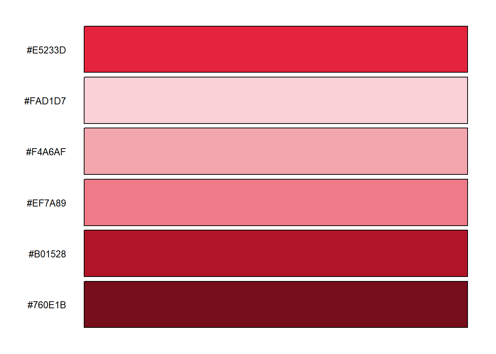
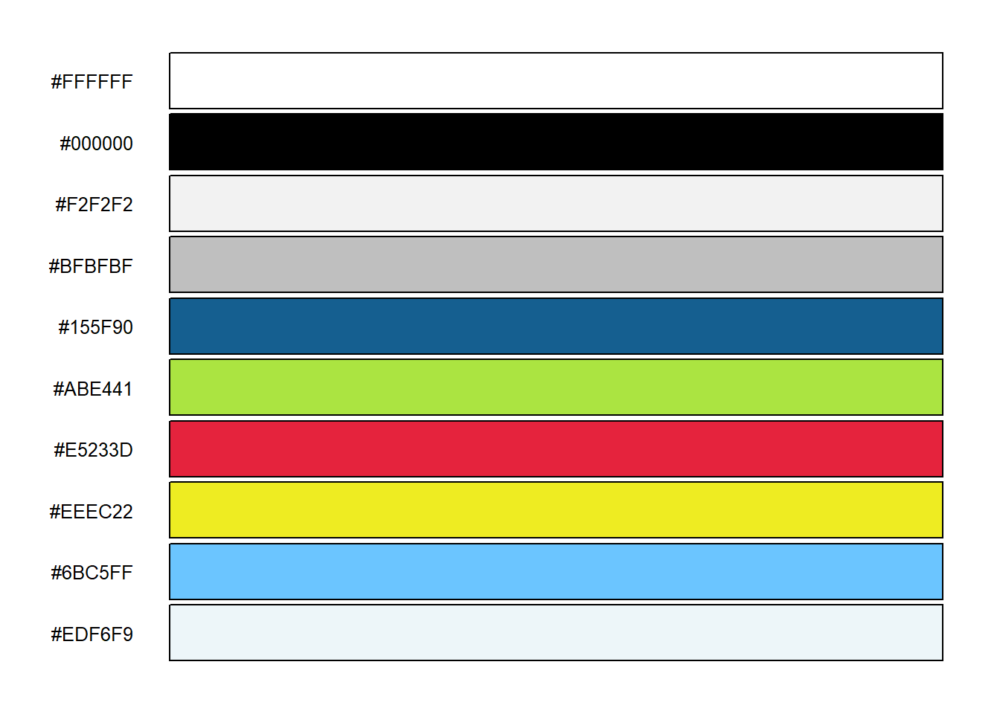
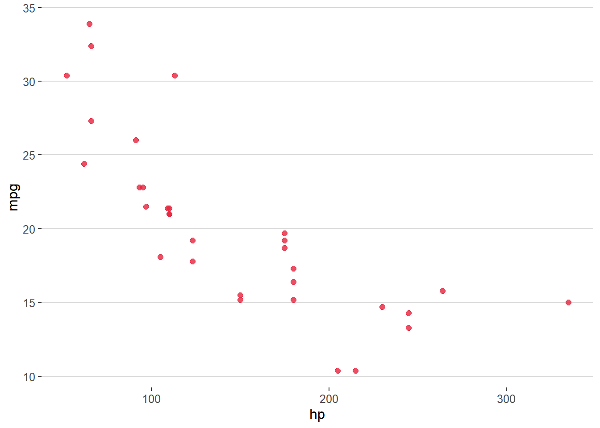
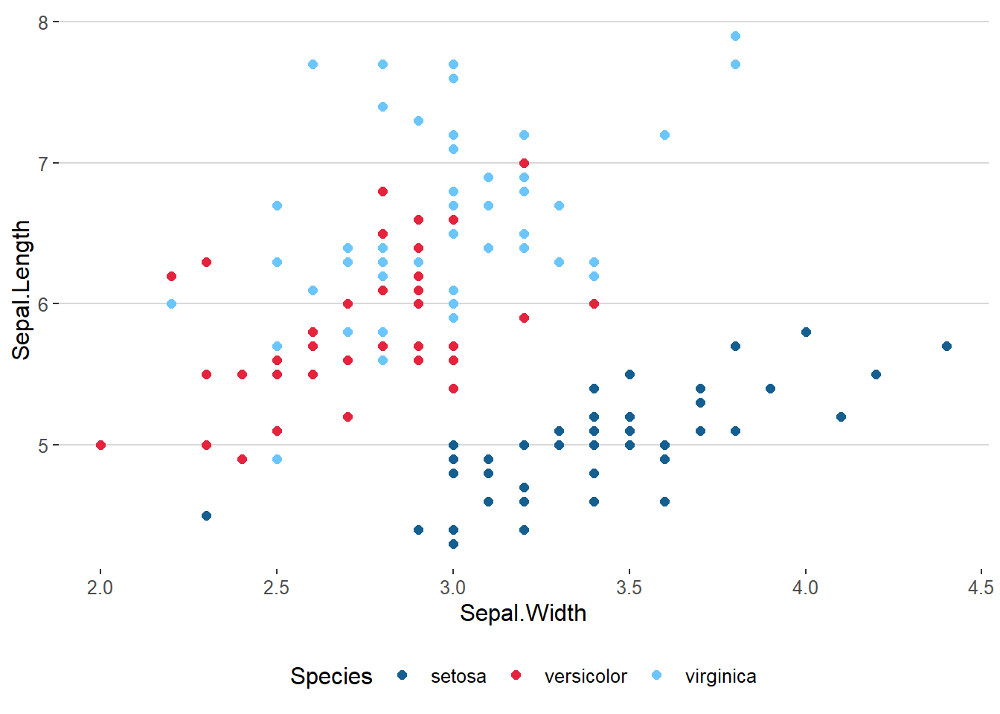
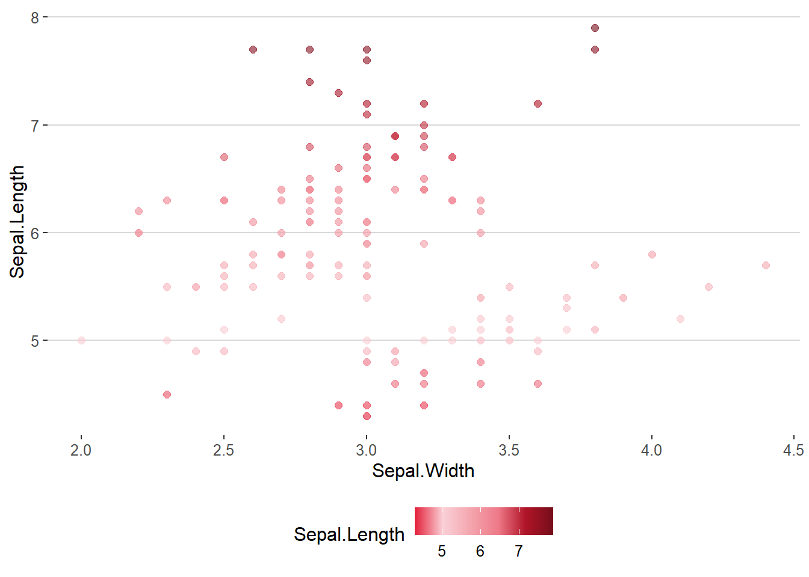
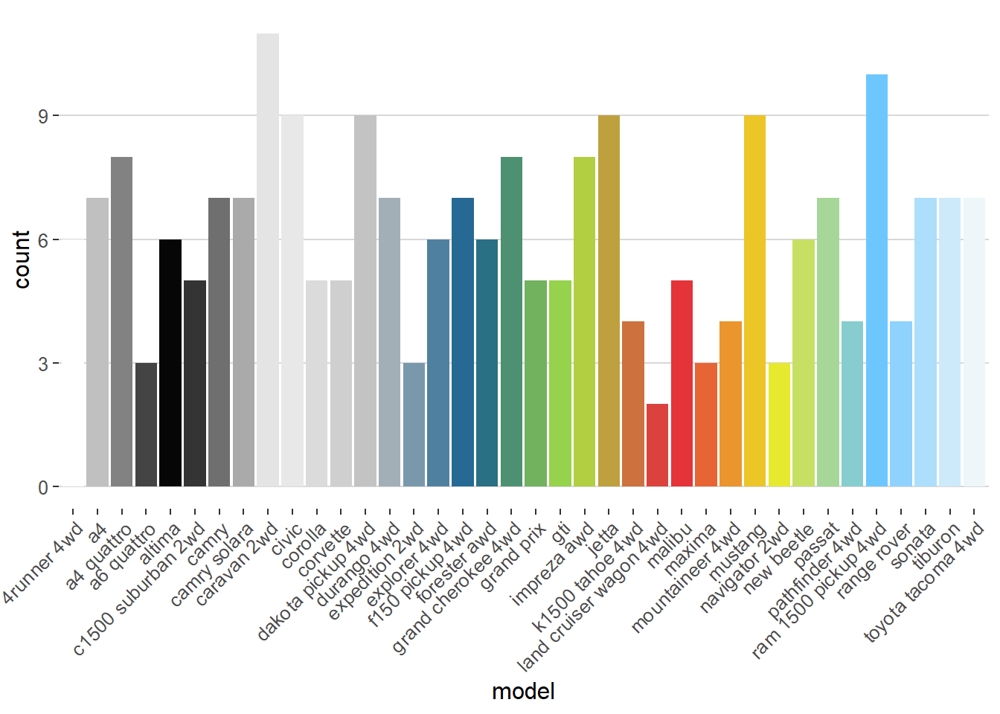

# bsscol ReadMe

bsscol allows for a simple integration of the BSS base colors into
ggplot2 and alike.

## installation and loading

You can install the released version of bsscol from
[Github](https://github.com/qwertzlbry/bsscol) with:

``` r
library(devtools) # install devtool first if not installed
install_github("qwertzlbry/bsscol")
```
Or just copy the package folder from:
“\(G:\BSS\Administration\05_BSS_Vorlagen\Farben_R_Stata\bsscol\)” into
your local R library and load it.

With a future CRAN approval the package could be installed with:

``` r
install.packages("bsscol") # currently the installation works only over github
```

In order to run the following examples you’ll also need:

``` r
install.packages("ggplot2")
install.packages("plotrix")
install.packages("dplyr")
install.packages("hues")
install.packages("ggthemes")
install.packages("DT")
install.packages("kableExtra")
```

``` r
library(bsscol)
library(ggplot2)
library(plotrix)
library(hues)
library(ggthemes)
library(dplyr, warn.conflicts=F, quietly=T)
library(kableExtra, warn.conflicts=F, quietly=T)
```

## the colors

### all colors

The following table contains all the BSS colors. When the package is
loaded this table can be called with the `bss_colors` command.

| R   | G   | B   | hex    |  Typ | Full        | col\_pal | hashed\_hex                                                                                                                                                               | excel\_form | name      |
| :-- | :-- | :-- | :----- | ---: | :---------- | -------: | :------------------------------------------------------------------------------------------------------------------------------------------------------------------------ | ----------: | :-------- |
| 255 | 255 | 255 | FFFFFF |    0 | 255,255,255 |        1 | <span style="     color: white !important;border-radius: 4px; padding-right: 4px; padding-left: 4px; background-color: #FFFFFF !important;text-align: c;">\#FFFFFF</span> |           1 | weiss     |
| 242 | 242 | 242 | F2F2F2 |  \-5 | 242,242,242 |        1 | <span style="     color: white !important;border-radius: 4px; padding-right: 4px; padding-left: 4px; background-color: #F2F2F2 !important;text-align: c;">\#F2F2F2</span> |          11 | NA        |
| 217 | 217 | 217 | D9D9D9 | \-15 | 217,217,217 |        1 | <span style="     color: white !important;border-radius: 4px; padding-right: 4px; padding-left: 4px; background-color: #D9D9D9 !important;text-align: c;">\#D9D9D9</span> |          21 | NA        |
| 191 | 191 | 191 | BFBFBF | \-25 | 191,191,191 |        1 | <span style="     color: white !important;border-radius: 4px; padding-right: 4px; padding-left: 4px; background-color: #BFBFBF !important;text-align: c;">\#BFBFBF</span> |          31 | NA        |
| 166 | 166 | 166 | A6A6A6 | \-35 | 166,166,166 |        1 | <span style="     color: white !important;border-radius: 4px; padding-right: 4px; padding-left: 4px; background-color: #A6A6A6 !important;text-align: c;">\#A6A6A6</span> |          41 | NA        |
| 128 | 128 | 128 | 808080 | \-50 | 128,128,128 |        1 | <span style="     color: white !important;border-radius: 4px; padding-right: 4px; padding-left: 4px; background-color: #808080 !important;text-align: c;">\#808080</span> |          51 | NA        |
| 0   | 0   | 0   | 000000 |    0 | 0,0,0       |        2 | <span style="     color: white !important;border-radius: 4px; padding-right: 4px; padding-left: 4px; background-color: #000000 !important;text-align: c;">\#000000</span> |           2 | schwarz   |
| 128 | 128 | 128 | 808080 |   50 | 128,128,128 |        2 | <span style="     color: white !important;border-radius: 4px; padding-right: 4px; padding-left: 4px; background-color: #808080 !important;text-align: c;">\#808080</span> |          12 | NA        |
| 89  | 89  | 89  | 595959 |   35 | 89,89,89    |        2 | <span style="     color: white !important;border-radius: 4px; padding-right: 4px; padding-left: 4px; background-color: #595959 !important;text-align: c;">\#595959</span> |          22 | NA        |
| 64  | 64  | 64  | 404040 |   25 | 64,64,64    |        2 | <span style="     color: white !important;border-radius: 4px; padding-right: 4px; padding-left: 4px; background-color: #404040 !important;text-align: c;">\#404040</span> |          32 | NA        |
| 38  | 38  | 38  | 262626 |   15 | 38,38,38    |        2 | <span style="     color: white !important;border-radius: 4px; padding-right: 4px; padding-left: 4px; background-color: #262626 !important;text-align: c;">\#262626</span> |          42 | NA        |
| 13  | 13  | 13  | 0D0D0D |    5 | 13,13,13    |        2 | <span style="     color: white !important;border-radius: 4px; padding-right: 4px; padding-left: 4px; background-color: #0D0D0D !important;text-align: c;">\#0D0D0D</span> |          52 | NA        |
| 242 | 242 | 242 | F2F2F2 |    0 | 242,242,242 |        3 | <span style="     color: white !important;border-radius: 4px; padding-right: 4px; padding-left: 4px; background-color: #F2F2F2 !important;text-align: c;">\#F2F2F2</span> |           3 | hellgrau1 |
| 218 | 218 | 218 | DADADA | \-10 | 218,218,218 |        3 | <span style="     color: white !important;border-radius: 4px; padding-right: 4px; padding-left: 4px; background-color: #DADADA !important;text-align: c;">\#DADADA</span> |          13 | NA        |
| 182 | 182 | 182 | B6B6B6 | \-25 | 182,182,182 |        3 | <span style="     color: white !important;border-radius: 4px; padding-right: 4px; padding-left: 4px; background-color: #B6B6B6 !important;text-align: c;">\#B6B6B6</span> |          23 | NA        |
| 121 | 121 | 121 | 797979 | \-50 | 121,121,121 |        3 | <span style="     color: white !important;border-radius: 4px; padding-right: 4px; padding-left: 4px; background-color: #797979 !important;text-align: c;">\#797979</span> |          33 | NA        |
| 61  | 61  | 61  | 3D3D3D | \-75 | 61,61,61    |        3 | <span style="     color: white !important;border-radius: 4px; padding-right: 4px; padding-left: 4px; background-color: #3D3D3D !important;text-align: c;">\#3D3D3D</span> |          43 | NA        |
| 23  | 23  | 23  | 171717 | \-90 | 23,23,23    |        3 | <span style="     color: white !important;border-radius: 4px; padding-right: 4px; padding-left: 4px; background-color: #171717 !important;text-align: c;">\#171717</span> |          53 | NA        |
| 191 | 191 | 191 | BFBFBF |    0 | 191,191,191 |        4 | <span style="     color: white !important;border-radius: 4px; padding-right: 4px; padding-left: 4px; background-color: #BFBFBF !important;text-align: c;">\#BFBFBF</span> |           4 | grau      |
| 242 | 242 | 242 | F2F2F2 |   80 | 242,242,242 |        4 | <span style="     color: white !important;border-radius: 4px; padding-right: 4px; padding-left: 4px; background-color: #F2F2F2 !important;text-align: c;">\#F2F2F2</span> |          14 | NA        |
| 230 | 230 | 230 | E6E6E6 |   60 | 230,230,230 |        4 | <span style="     color: white !important;border-radius: 4px; padding-right: 4px; padding-left: 4px; background-color: #E6E6E6 !important;text-align: c;">\#E6E6E6</span> |          24 | NA        |
| 217 | 217 | 217 | D9D9D9 |   40 | 217,217,217 |        4 | <span style="     color: white !important;border-radius: 4px; padding-right: 4px; padding-left: 4px; background-color: #D9D9D9 !important;text-align: c;">\#D9D9D9</span> |          34 | NA        |
| 143 | 143 | 143 | 8F8F8F | \-25 | 143,143,143 |        4 | <span style="     color: white !important;border-radius: 4px; padding-right: 4px; padding-left: 4px; background-color: #8F8F8F !important;text-align: c;">\#8F8F8F</span> |          44 | NA        |
| 96  | 96  | 96  | 606060 | \-50 | 96,96,96    |        4 | <span style="     color: white !important;border-radius: 4px; padding-right: 4px; padding-left: 4px; background-color: #606060 !important;text-align: c;">\#606060</span> |          54 | NA        |
| 21  | 95  | 144 | 155F90 |    0 | 21,95,144   |        5 | <span style="     color: white !important;border-radius: 4px; padding-right: 4px; padding-left: 4px; background-color: #155F90 !important;text-align: c;">\#155F90</span> |           5 | blau      |
| 193 | 225 | 247 | C1E1F7 |   80 | 193,225,247 |        5 | <span style="     color: white !important;border-radius: 4px; padding-right: 4px; padding-left: 4px; background-color: #C1E1F7 !important;text-align: c;">\#C1E1F7</span> |          15 | NA        |
| 135 | 197 | 237 | 87C5ED |   60 | 135,197,237 |        5 | <span style="     color: white !important;border-radius: 4px; padding-right: 4px; padding-left: 4px; background-color: #87C5ED !important;text-align: c;">\#87C5ED</span> |          25 | NA        |
| 73  | 167 | 228 | 49A7E4 |   40 | 73,167,228  |        5 | <span style="     color: white !important;border-radius: 4px; padding-right: 4px; padding-left: 4px; background-color: #49A7E4 !important;text-align: c;">\#49A7E4</span> |          35 | NA        |
| 16  | 71  | 107 | 10476B | \-25 | 16,71,107   |        5 | <span style="     color: white !important;border-radius: 4px; padding-right: 4px; padding-left: 4px; background-color: #10476B !important;text-align: c;">\#10476B</span> |          45 | NA        |
| 11  | 48  | 72  | 0B3048 | \-50 | 11,48,72    |        5 | <span style="     color: white !important;border-radius: 4px; padding-right: 4px; padding-left: 4px; background-color: #0B3048 !important;text-align: c;">\#0B3048</span> |          55 | NA        |
| 171 | 228 | 65  | ABE441 |    0 | 171,228,65  |        6 | <span style="     color: white !important;border-radius: 4px; padding-right: 4px; padding-left: 4px; background-color: #ABE441 !important;text-align: c;">\#ABE441</span> |           6 | grün      |
| 238 | 250 | 216 | EEFAD8 |   80 | 238,250,216 |        6 | <span style="     color: white !important;border-radius: 4px; padding-right: 4px; padding-left: 4px; background-color: #EEFAD8 !important;text-align: c;">\#EEFAD8</span> |          16 | NA        |
| 221 | 244 | 179 | DDF4B3 |   60 | 221,244,179 |        6 | <span style="     color: white !important;border-radius: 4px; padding-right: 4px; padding-left: 4px; background-color: #DDF4B3 !important;text-align: c;">\#DDF4B3</span> |          26 | NA        |
| 204 | 238 | 140 | CCEE8C |   40 | 204,238,140 |        6 | <span style="     color: white !important;border-radius: 4px; padding-right: 4px; padding-left: 4px; background-color: #CCEE8C !important;text-align: c;">\#CCEE8C</span> |          36 | NA        |
| 134 | 191 | 28  | 86BF1C | \-25 | 134,191,28  |        6 | <span style="     color: white !important;border-radius: 4px; padding-right: 4px; padding-left: 4px; background-color: #86BF1C !important;text-align: c;">\#86BF1C</span> |          46 | NA        |
| 90  | 129 | 18  | 5A8112 | \-50 | 90,129,18   |        6 | <span style="     color: white !important;border-radius: 4px; padding-right: 4px; padding-left: 4px; background-color: #5A8112 !important;text-align: c;">\#5A8112</span> |          56 | NA        |
| 229 | 35  | 61  | E5233D |    0 | 229,35,61   |        7 | <span style="     color: white !important;border-radius: 4px; padding-right: 4px; padding-left: 4px; background-color: #E5233D !important;text-align: c;">\#E5233D</span> |           7 | rot       |
| 250 | 209 | 215 | FAD1D7 |   80 | 250,209,215 |        7 | <span style="     color: white !important;border-radius: 4px; padding-right: 4px; padding-left: 4px; background-color: #FAD1D7 !important;text-align: c;">\#FAD1D7</span> |          17 | NA        |
| 244 | 166 | 175 | F4A6AF |   60 | 244,166,175 |        7 | <span style="     color: white !important;border-radius: 4px; padding-right: 4px; padding-left: 4px; background-color: #F4A6AF !important;text-align: c;">\#F4A6AF</span> |          27 | NA        |
| 239 | 122 | 137 | EF7A89 |   40 | 239,122,137 |        7 | <span style="     color: white !important;border-radius: 4px; padding-right: 4px; padding-left: 4px; background-color: #EF7A89 !important;text-align: c;">\#EF7A89</span> |          37 | NA        |
| 176 | 21  | 40  | B01528 | \-25 | 176,21,40   |        7 | <span style="     color: white !important;border-radius: 4px; padding-right: 4px; padding-left: 4px; background-color: #B01528 !important;text-align: c;">\#B01528</span> |          47 | NA        |
| 118 | 14  | 27  | 760E1B | \-50 | 118,14,27   |        7 | <span style="     color: white !important;border-radius: 4px; padding-right: 4px; padding-left: 4px; background-color: #760E1B !important;text-align: c;">\#760E1B</span> |          57 | NA        |
| 238 | 236 | 34  | EEEC22 |    0 | 238,236,34  |        8 | <span style="     color: white !important;border-radius: 4px; padding-right: 4px; padding-left: 4px; background-color: #EEEC22 !important;text-align: c;">\#EEEC22</span> |           8 | gelb      |
| 252 | 252 | 209 | FCFCD1 |   80 | 252,252,209 |        8 | <span style="     color: white !important;border-radius: 4px; padding-right: 4px; padding-left: 4px; background-color: #FCFCD1 !important;text-align: c;">\#FCFCD1</span> |          18 | NA        |
| 249 | 249 | 166 | F9F9A6 |   60 | 249,249,166 |        8 | <span style="     color: white !important;border-radius: 4px; padding-right: 4px; padding-left: 4px; background-color: #F9F9A6 !important;text-align: c;">\#F9F9A6</span> |          28 | NA        |
| 244 | 244 | 121 | F4F479 |   40 | 244,244,121 |        8 | <span style="     color: white !important;border-radius: 4px; padding-right: 4px; padding-left: 4px; background-color: #F4F479 !important;text-align: c;">\#F4F479</span> |          38 | NA        |
| 189 | 189 | 15  | BDBD0F | \-25 | 189,189,15  |        8 | <span style="     color: white !important;border-radius: 4px; padding-right: 4px; padding-left: 4px; background-color: #BDBD0F !important;text-align: c;">\#BDBD0F</span> |          48 | NA        |
| 126 | 126 | 10  | 7E7E0A | \-50 | 126,126,10  |        8 | <span style="     color: white !important;border-radius: 4px; padding-right: 4px; padding-left: 4px; background-color: #7E7E0A !important;text-align: c;">\#7E7E0A</span> |          58 | NA        |
| 107 | 197 | 255 | 6BC5FF |    0 | 107,197,255 |        9 | <span style="     color: white !important;border-radius: 4px; padding-right: 4px; padding-left: 4px; background-color: #6BC5FF !important;text-align: c;">\#6BC5FF</span> |           9 | hellblau  |
| 225 | 243 | 255 | E1F3FF |   80 | 225,243,255 |        9 | <span style="     color: white !important;border-radius: 4px; padding-right: 4px; padding-left: 4px; background-color: #E1F3FF !important;text-align: c;">\#E1F3FF</span> |          19 | NA        |
| 196 | 232 | 255 | C4E8FF |   60 | 196,232,255 |        9 | <span style="     color: white !important;border-radius: 4px; padding-right: 4px; padding-left: 4px; background-color: #C4E8FF !important;text-align: c;">\#C4E8FF</span> |          29 | NA        |
| 166 | 219 | 255 | A6DBFF |   40 | 166,219,255 |        9 | <span style="     color: white !important;border-radius: 4px; padding-right: 4px; padding-left: 4px; background-color: #A6DBFF !important;text-align: c;">\#A6DBFF</span> |          39 | NA        |
| 15  | 159 | 255 | 0F9FFF | \-25 | 15,159,255  |        9 | <span style="     color: white !important;border-radius: 4px; padding-right: 4px; padding-left: 4px; background-color: #0F9FFF !important;text-align: c;">\#0F9FFF</span> |          49 | NA        |
| 0   | 108 | 181 | 006CB5 | \-50 | 0,108,181   |        9 | <span style="     color: white !important;border-radius: 4px; padding-right: 4px; padding-left: 4px; background-color: #006CB5 !important;text-align: c;">\#006CB5</span> |          59 | NA        |
| 237 | 246 | 249 | EDF6F9 |    0 | 237,246,249 |       10 | <span style="     color: white !important;border-radius: 4px; padding-right: 4px; padding-left: 4px; background-color: #EDF6F9 !important;text-align: c;">\#EDF6F9</span> |          10 | hellgrau2 |
| 201 | 228 | 237 | C9E4ED | \-10 | 201,228,237 |       10 | <span style="     color: white !important;border-radius: 4px; padding-right: 4px; padding-left: 4px; background-color: #C9E4ED !important;text-align: c;">\#C9E4ED</span> |          20 | NA        |
| 146 | 200 | 218 | 92C8DA | \-25 | 146,200,218 |       10 | <span style="     color: white !important;border-radius: 4px; padding-right: 4px; padding-left: 4px; background-color: #92C8DA !important;text-align: c;">\#92C8DA</span> |          30 | NA        |
| 61  | 152 | 182 | 3D98B6 | \-50 | 61,152,182  |       10 | <span style="     color: white !important;border-radius: 4px; padding-right: 4px; padding-left: 4px; background-color: #3D98B6 !important;text-align: c;">\#3D98B6</span> |          40 | NA        |
| 30  | 77  | 91  | 1E4D5B | \-75 | 30,77,91    |       10 | <span style="     color: white !important;border-radius: 4px; padding-right: 4px; padding-left: 4px; background-color: #1E4D5B !important;text-align: c;">\#1E4D5B</span> |          50 | NA        |
| 12  | 30  | 35  | 0C1E23 | \-90 | 12,30,35    |       10 | <span style="     color: white !important;border-radius: 4px; padding-right: 4px; padding-left: 4px; background-color: #0C1E23 !important;text-align: c;">\#0C1E23</span> |          60 | NA        |

Filtering the table by e.g. palettes (col\_pal)

``` r
choice <- bss_colors %>% filter(col_pal == 7)
swatch(choice$hashed_hex)
```



### basic colors

The following diagram contains all basic bss colors. They are stored in
a vector with the corresponding names. Unlike to the bss\_colors table,
these colors can therfore be called in functions by their names. When
the package is loaded the vector can be called with the `basic_colors`
command. However, the basic bss colors can also be found in the bigger
above showed bss\_colors table, as it includes all colors.



``` r
basic_colors
#>     weiss   schwarz hellgrau1      grau      blau      grün       rot      gelb 
#> "#FFFFFF" "#000000" "#F2F2F2" "#BFBFBF" "#155F90" "#ABE441" "#E5233D" "#EEEC22" 
#>  hellblau hellgrau2 
#> "#6BC5FF" "#EDF6F9"
```

## function: bss\_cols() - examples

The bss\_cols function allows you to get and reference hex colors in a
robust and flexible way for the basic\_colors. As you can see in the
example below, I am calling the colours by their names. Hence, this
function does not work with the hex codes of the big, above showed
bss\_colors table.

``` r
# to get the basic colors
bss_cols()
#>     weiss   schwarz hellgrau1      grau      blau      grün       rot      gelb 
#> "#FFFFFF" "#000000" "#F2F2F2" "#BFBFBF" "#155F90" "#ABE441" "#E5233D" "#EEEC22" 
#>  hellblau hellgrau2 
#> "#6BC5FF" "#EDF6F9"
# to get the information of a color
bss_cols("rot")
#>       rot 
#> "#E5233D"
# or to just use a color in a plot
ggplot(mtcars, aes(hp, mpg)) +
  geom_point(color = bss_cols("rot"),
             size = 2, alpha = .8)+ 
  theme_hc()
```



## function: bss\_pal() - examples

With the command `bss_palettes` you can see all the coded palettes
stored in a list.

``` r
# the following subset color palettes are available 
bss_palettes
#> $monochrom_black1
#>            [,1]      [,2]      [,3]      [,4]      [,5]      [,6]     
#> hashed_hex "#FFFFFF" "#F2F2F2" "#D9D9D9" "#BFBFBF" "#A6A6A6" "#808080"
#> 
#> $monochrom_green
#>            [,1]      [,2]      [,3]      [,4]      [,5]      [,6]     
#> hashed_hex "#ABE441" "#EEFAD8" "#DDF4B3" "#CCEE8C" "#86BF1C" "#5A8112"
#> 
#> $monochrom_red
#>            [,1]      [,2]      [,3]      [,4]      [,5]      [,6]     
#> hashed_hex "#E5233D" "#FAD1D7" "#F4A6AF" "#EF7A89" "#B01528" "#760E1B"
#> 
#> $monochrom_yellow
#>            [,1]      [,2]      [,3]      [,4]      [,5]      [,6]     
#> hashed_hex "#EEEC22" "#FCFCD1" "#F9F9A6" "#F4F479" "#BDBD0F" "#7E7E0A"
#> 
#> $monochrom_blue
#>            [,1]      [,2]      [,3]      [,4]      [,5]      [,6]     
#> hashed_hex "#6BC5FF" "#E1F3FF" "#C4E8FF" "#A6DBFF" "#0F9FFF" "#006CB5"
#> 
#> $main
#>            [,1]      [,2]      [,3]      [,4]      [,5]      [,6]     
#> hashed_hex "#FFFFFF" "#000000" "#F2F2F2" "#BFBFBF" "#155F90" "#ABE441"
#>            [,7]      [,8]      [,9]      [,10]    
#> hashed_hex "#E5233D" "#EEEC22" "#6BC5FF" "#EDF6F9"
#> 
#> $main_only_color
#>            [,1]      [,2]      [,3]      [,4]      [,5]     
#> hashed_hex "#155F90" "#ABE441" "#E5233D" "#EEEC22" "#6BC5FF"
```

The function `bss_pal()` allows to interpolate the palette colors for a
certain number of levels, making it possible to create shades between
the original colors using colorRampPalette from grDevices. This command
can be used to extend to numbers of colors in a palette, however the hex
codes of some color shades can then deviate from the above bss\_colors
table. Therefore, I recommend to use the coded palettes mentioned above,
if possible.

``` r
# interpolate the "main_only_color" palette (which only includes five colors) to a length of 20:
bss_pal("main_only_color")(20)
#>  [1] "#155F90" "#347B7F" "#54976E" "#73B35E" "#93CF4D" "#AED940" "#BAB13F"
#>  [8] "#C6883F" "#D25F3E" "#DE373D" "#E5383A" "#E76234" "#E98C2E" "#EBB729"
#> [15] "#EDE123" "#D9E544" "#BDDD73" "#A2D5A1" "#86CDD0" "#6BC5FF"
```

The function `bss_pal` gets a palette by name from the list above
(“main\_only\_color” by default) and has a boolean condition (`rev
=T/F`) determining whether to reverse the order of colors or not.

``` r
# Example of pie chart extending monochrom_yellow palettes to 50 shades.
pie3D(rep(5, 50),explode=0, theta=1.2, col=bss_pal(rev = T,"monochrom_yellow")(50),main="bss_pal('monochrom_yellow')(50)")
```


## function: scale\_color\_bss() - example

`scale_color_bss()` is a custom color scale functions for ggplot2 plots.
The same could also be achived with the function `scale_colour_manual`
of the ggplot2 package. However, the usage of the bsscol palettes makes
this process more tidy and efficient. In the function two boolean
parameters `discrete = T/F, reverse = T/F` can be choosen.

``` r
# Color by discrete variable using default palette main_only_color
ggplot(iris, aes(Sepal.Width, Sepal.Length, color = Species)) +
  geom_point(size = 2) +
  scale_color_bss() +
  theme_hc()
```



``` r

# Color by numeric variable with monochrom_red palette
ggplot(iris, aes(Sepal.Width, Sepal.Length, color = Sepal.Length)) +
  geom_point(size = 2, alpha = .6) +
  scale_color_bss(discrete = FALSE, palette = "monochrom_red")+
  theme_hc()
```



## function: scale\_fill\_bss() - example

`scale_fill_bss()` is a custom fill scale functions for ggplot2 plots.
The same could also be achived with the function `scale_fill_manual` of
the ggplot2 package. However, the usage of the bsscol palettes makes
this process more tidy and efficient. The shades of colors is
automattically extended when using more colors than a palettes has to
offer.In the function to boolean parameters `discrete = T/F, reverse =
T/F` can be choosen.

``` r
# Fill by discrete variable with the main palette + remove legend (guide)
ggplot(mpg, aes(model          , fill = model         )) +
  geom_bar() +
  theme(axis.text.x = element_text(angle = 45, hjust = 1)) +
  scale_fill_bss(palette = "main", guide = "none")+
  theme_hc()
```


### Markdown

Markdown is a lightweight and easy-to-use syntax for styling your writing. It includes conventions for

```markdown
Syntax highlighted code block

# Header 1
## Header 2
### Header 3

- Bulleted
- List

1. Numbered
2. List

**Bold** and _Italic_ and `Code` text

[Link](url) and 
```

For more details see [GitHub Flavored Markdown](https://guides.github.com/features/mastering-markdown/).

### Jekyll Themes

Your Pages site will use the layout and styles from the Jekyll theme you have selected in your [repository settings](https://github.com/qwertzlbry/bsscol/settings). The name of this theme is saved in the Jekyll `_config.yml` configuration file.

### Support or Contact

Having trouble with Pages? Check out our [documentation](https://docs.github.com/categories/github-pages-basics/) or [contact support](https://support.github.com/contact) and we’ll help you sort it out.
